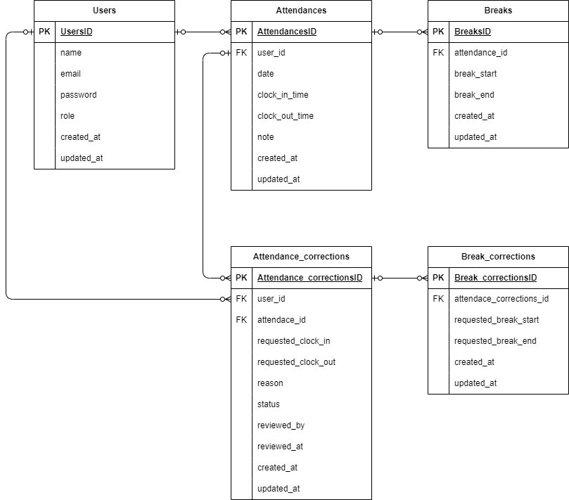

# 勤怠管理アプリケーション

## 開発環境構築

### Docker ビルド

1. git clone git@github.com:orochan89/attendance-management-app.git
2. docker compose up -d --build

### Laravel 環境構築

1. docker-compose exec php bash
2. composer install
3. .env.example ファイルから .env を作成し、環境変数を変更
4. php artisan key:generate
5. php artisan migrate
6. php artisan db:seed

#### 開発環境 .env ファイル

APP_NAME=Laravel  
APP_ENV=local  
APP_KEY=base64:jcb68tfdIk9MKgIenuvCoYE49ZZ3Sd7g0QZ7fkBDC4Q=  
APP_DEBUG=true  
APP_URL=http://localhost

LOG_CHANNEL=stack  
LOG_DEPRECATIONS_CHANNEL=null  
LOG_LEVEL=debug

DB_CONNECTION=mysql  
DB_HOST=mysql  
DB_PORT=3306  
DB_DATABASE=laravel_db  
DB_USERNAME=laravel_user  
DB_PASSWORD=laravel_pass

BROADCAST_DRIVER=log  
CACHE_DRIVER=file  
FILESYSTEM_DRIVER=local  
QUEUE_CONNECTION=sync  
SESSION_DRIVER=file  
SESSION_LIFETIME=120

MEMCACHED_HOST=127.0.0.1

REDIS_HOST=127.0.0.1  
REDIS_PASSWORD=null  
REDIS_PORT=6379

MAIL_MAILER=smtp  
MAIL_HOST=mailhog  
MAIL_PORT=1025  
MAIL_USERNAME=null  
MAIL_PASSWORD=null  
MAIL_ENCRYPTION=null  
MAIL_FROM_ADDRESS=noreply@example.com  
MAIL_FROM_NAME="${APP_NAME}"

AWS_ACCESS_KEY_ID=  
AWS_SECRET_ACCESS_KEY=  
AWS_DEFAULT_REGION=us-east-1  
AWS_BUCKET=  
AWS_USE_PATH_STYLE_ENDPOINT=false

PUSHER_APP_ID=  
PUSHER_APP_KEY=  
PUSHER_APP_SECRET=  
PUSHER_APP_CLUSTER=mt1

MIX_PUSHER_APP_KEY="${PUSHER_APP_KEY}"  
MIX_PUSHER_APP_CLUSTER="${PUSHER_APP_CLUSTER}"

## 作成済みユーザー情報

スタッフ画面ログイン用  
Email : test@example.com  
Password : password

管理者画面ログイン用  
Email : admin@example.com  
Password : password

## メール認証

MailHog を使用  
http://localhost:8025/

## 使用技術

・ php 8.1  
・ Laravel 8.\*  
・ MySQL 8.0.26  
・ JavaScript  
・ MailHog

## ER 図

## URL

・ 開発環境 : http://localhost/  
・ phpMyAdmin : http://localhost:8080/  
・ MailHog : http://localhost:8025/

## テスト実行用の環境構築

### テスト用 .env.testing ファイルの作成

1. docker-compose exec php bash
2. cp .env .env.testing **上記 Laravel 環境構築で作成した .env ファイルをコピーする事**
3. .env.testing 内の環境変数を以下の通り変更

   APP_ENV=test  
   APP_KEY=

   DB_DATABASE=demo_test  
    DB_USERNAME=root  
    DB_PASSWORD=root

### テスト用データベースの作成

1. docker-compose exec mysql bash
2. mysql -u root -p
3. password:root
4. CREATE DATABASE demo_test;

### テスト環境のセットアップ

1. docker-compose exec php bash
2. php artisan key:generate --env=testing
3. php artisan config:clear
4. php artisan migrate --env=testing

### テストの実行

1. php artisan test
